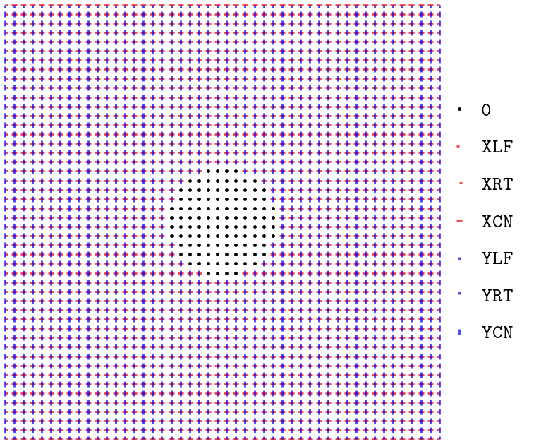
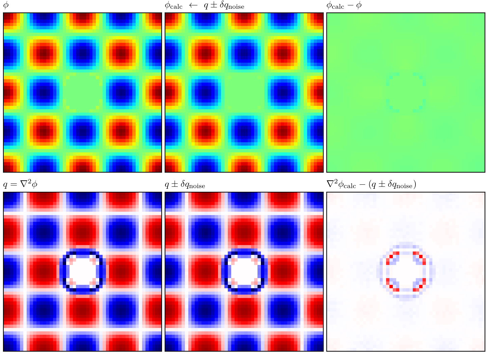
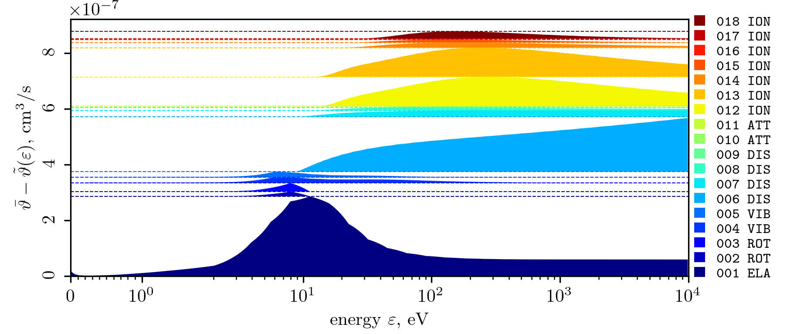

_[document version: 20260216]_
<!-- {𝐯} {𝐫} {𝐟} {𝐚} {𝐄} {𝐁} {𝐮} -->
> [!NOTE]
>The project is still under active development, so changes and modifications are possible.
>Some features are missing, and other features haven't been tested properly, yet.

# \_ltplib: <ins>L</ins>ow <ins>T</ins>emperature <ins>P</ins>lasma <ins>Lib</ins>rary
This is a middle-layer framework that provides a simple Python solution to construct PiC+MCC simulations ([Particles-in-Cells](https://en.wikipedia.org/wiki/Particle-in-cell) + [Monte Carlo Collisions](https://www.particleincell.com/2011/mcc/)).
The framework offers a range of functions and primitives to facilitate a broad set of low-temperature (non-relativistic) plasma kinetic problems.
By creating a high-level, user-friendly Python API, **\_ltplib** aims to enable researchers and engineers to formulate and solve both simple and complex PiC+MCC problems via modern computational techniques.

Features:
- one-, two-, and three-dimensional problems with periodic or absorptive boundary conditions;
- high-order form factors (up to 3);
- explicit or semi-implicit particle movers;
- fast and flexible Monte Carlo module allowing to simulate arbitrary mixtures of active and background components, taking into account anisotropic scattering,
- universal data-driven solver for the Poisson equation.

The code is based on the former Θ-Hall [^chernyshev2019][^chernyshev2022], but it has been heavily modified and rewritten from scratch.
The project was inspired by [eduPIC](https://github.com/donkozoltan/eduPIC),
[PIC-skeleton-codes](https://github.com/UCLA-Plasma-Simulation-Group/PIC-skeleton-codes),
and [LoKI-MC](https://github.com/IST-Lisbon/LoKI-MC).

## Table of contents
1. [Build instructions](#build)
1. [Main classes](#classes)
	1. [`_ltplib.grid`](#grid)
	1. [`_ltplib.pstore`](#pstore)
	1. [`_ltplib.vcache`](#vcache)
	1. [`_ltplib.csection_set`](#csection_set)
	1. [`_ltplib.poisson_eq`](#poisson_eq)
1. [Function bindings](#binding)
	1. [`_ltplib.bind_ppush_fn`](#bind_ppush)
	1. [`_ltplib.bind_ppost_fn`](#bind_ppost)
	1. [`_ltplib.bind_mcsim_fn`](#bind_mcsim)
1. [TODO roadmap](#roadmap)
1. [Code examples](#code_examples)
	1. [`examples/run_localsim.py`](#run_localsim)
	1. [`examples/run_spatialsim.py`](#run_spatialsim)
	1. [`examples/run_two_stream.py`](#run_two_stream)

## Build instructions <a name="build"></a>
The framework uses [pybind11](https://github.com/pybind/pybind11) to create a transparent interface between Python and C++ code. Dependencies are downloaded automatically by CMake FetchContent.
Make sure that you have Python development files installed
([python3-dev](https://packages.debian.org/stable/python3-dev) package on deb-based distros)
```sh
cmake -S src -B build && cmake --build build --target install
```
As a result, two libraries will be generated in the `examples` directory:
1. `examples/_default.so`, the backend library containing OpenMP-based solvers;
1. `examples/_ltplib.so`, the framework itself.

Native Python installation via pip is not yet supported, so just copy both binaries into your project's directory (or use `-DCMAKE_INSTALL_PREFIX`).
It is highly recommended to have [numpy](https://github.com/numpy/numpy) installed.
It is not necessary to run **\_ltplib**, but [numpy.ndarray](https://numpy.org/doc/stable/reference/arrays.ndarray.html) is used as a main interface between userspace python-code and **\_ltplib**.
Built-in documentation is available as follows:
```python
import _ltplib as ltp
help(ltp)

```
<!-- ## Brief introduction into PiC+MCC <a name="intro"></a> -->
<!-- {𝐯} {𝐫} {𝐟} {𝐚} {𝐄} {𝐁} {𝐮} -->
<!-- $f_i\left({𝐫},\,{𝐯},\,t\right)$ -->
<!-- (To be done...) -->

The following sections provide a brief overview of **\_ltplib** components.

## Main classes <a name="classes"></a>
### [`_ltplib.grid`](./src/_ltplib/def_grid.cxx) (problem's geometry) <a name="grid"></a>
The grid is a primary class for every simulation.
It describes the geometry of the problem, boundary conditions, and spatial decomposition for parallel computation.
The code uses a slightly modified approach of tile decomposition described in the papers [^decyk2014][^decyk2015]. The class constructor accepts the following arguments:
1. *nd* -- number of spatial dimensions;
1. *step* — list containing spatial steps along the each axis;
1. *axes* — list describing spatial decomposition along the each axis;
1. *nodes* (optional) — list containing tuples to map computing nodes (will be created automatically if not given);
1. *mask* (optional) — mask to mark adsorbing regions; 
1. *flags* (optional) — flags to mark periodic boundaries (`"LOOPX|LOOPY|LOOPZ"`) and/or $x$-axis for axial-symmetric geometry (`"CYLINDER"`).

The next example shows how `_ltplib.grid` can be constructed:
```python
grid = ltp.grid(2 # Two-dimensional problem
 # First, let's define the spatial step for each dimension:
 , step = [0.25, 0.25] # dx, dy

 # The next two sections describe domain decomposition.
 # Here, the numbers in between define the edges of sub-domains:
 , axes = [
  # x-axis, 4 slices
  [0, 6, 12, 18, 24],
  # y-axis, 4 slices
  [0, 4, 8, 12, 16], 
 ]
 # The position of each node is described relative to the "axes":
 , nodes = [
  (0, 0),
  (0, 1),
  (0, 2),
  ...
 ],
 # Or skip it and nodes will be created automatically.
 
 # It is possible to mark some points as particle absorbers
 # using the optional "mask" parameter:
 , mask = [...] # numpy.uint8 array, with the same shape as the grid axes.
 # Any value != 0 will be considered as an adsorbing cell.
 
 # Axes can be marked with flags:
 , flags = "LOOPX|LOOPY"
)
```
The following figure shows the grid described before:
<br>

<br>

### [`_ltplib.pstore`](./src/_ltplib/def_pstore.cxx) (particle storage) <a name="pstore"></a>
This class is used to store pVDF samples (macro-particles).
The class constructor accepts the following arguments:
1. *grid* — existing grid;
1. *ptinfo* — description of active components to store;
1. *capacity* — the maximum number of samples per node;
1. *vsize* (optional) — the number of components to store, `1+grid.nd+3` by default.

See the example:
```python
pstore = ltp.pstore(grid, # existing grid
 cfg = [
  {"KEY":"e",   "CHARGE/MASS": -5.272810e+17}, # electron
  {"KEY":"Ar+", "CHARGE/MASS": +7.240801e+12}, # argon ion
 ],
 capaticy = 100000, # the limit is 16777216 samples per node
 vsize    = 1+2*(grid.nd+3), # in case of using with semi-implicit mover
)
```

#### Methods
To **inject** samples into the class `pstore.inject({...})` method should be called.
Method accepts a dictionary, where keys correspond to component keys from `"ptinfo"`,
and values are numpy arrays to load.
The shape of the input array should match `[npp, grid.nd+3]`, where `npp` is the number of samples to add.
The components of sample's vector are $\{x\,\dots\,v_x\,v_y\,v_z\}$.

To **extract** the samples, `pstore.extract()` should be used.
Method accepts no arguments and returns the pair:
1. numpy-arrays containing all the samples,
1. list of indices defining the sample range for each component
(the components' order is the same as in ptinfo).

To **reset** (clean) the storage, use `pstore.reset()`.
Also, calling `len(pstore)` will return the total number of samples.

### [`_ltplib.vcache`](./src/_ltplib/def_vcache.cxx) (value cache) <a name="vcache"></a>
This class is used as a universal node-local cache for grid-based values. For example, it can be used to store electromagnetic fields, pVDF moments, background densities, and collision frequencies.
Class constructor accepts the following arguments:
1. *grid* — existing grid.
1. *dtype* — the string describing type (`"f32"` or `"u32"`).
1. *vsize* (optional) — number of components per grid unit, default `1`.
1. *order* (optional) — form-factor's order, default is `0`.

Use `vcache[...]` to read/write values into numpy buffer.
Method `vcache.remap(str: mode)` should be used to transfer data between
node-local cache and numpy buffer:
`mode="in"`, to copy data *from* the buffer into the cache;
`mode="out"`, to copy data from the cache *into* the buffer.

There are the following useful properties:
- `vcache.dtype` — python-type,
- `vcache.shape` — shape of representing array,
- `vcache.order` — form-factor's order,
- `vcache.cfg` — helper to construct numpy-arrays: `numpy.empty(**vcache.cfg)`.

### [`_ltplib.csection_set`](./src/_ltplib/def_csection_set.cxx) (cross-section set) <a name="csection_set"></a>
This class stores the cross-section database for Monte-Carlo simulation.
Input cross-sections can be defined by the function or by the points.
In both cases, they will be recalculated into cumulative rates and cached into the lookup table on a log-scaled energy grid
$\varepsilon = \varepsilon_{\rm th} + 2^{j/2-4}-0.0625,~j\in\mathbb{N}$,
where $\varepsilon_{\rm th}$ is reaction's threshold.
This allows the store a large number of cross-sections in a very compact way.
Constructor parameters for the class are:
1. *cfg* — configuration sequence (see below);
1. *max_energy* — energy limit defining lookup-table's size;
1. *ptdescr* — string containing keys for active components, separated by spaces.
This argument **must** exactly match the components from `_ltplib.pstore`.
1. *bgdescr* (optional) — string containing keys for background components, separated by spaces.
If given, the class will ignore all other backgrounds from the configuration sequence.

There are optional keyword arguments:
- *rescale* — global scale factor for cross-section values.
- *exterp* — global extrapolation factor (see below).

#### Configuration sequence
All processes are described in a list of dict-entries.
There are three types of entries. Firstly, the active component should be selected (`"TYPE":"PARTICLE"`).
For example
```python
{"TYPE": "PARTICLE", "KEY": "e",
 "ENCFFT": 2.842815e-16, # coefficient to transform speed$^2$ -> energy
},
```
Secondly, the background should be described (`"TYPE":"BACKGROUND"`)
```python
{"TYPE": "BACKGROUND", "KEY": "CH4",
 "MASSRATE":3.420074282530393e-05, # m/M coefficient
},
```
> [!NOTE]
> The current version of **\_ltplib** doesn't support flux & thermal thermal velocities for the background.
> Such functionality will be added later.
> Now it is considered frozen in the laboratory frame of reference.

The processes' description follows next.
For these entries, `"TYPE"` could be
- `"ELASTIC"`
- `"EXCITATION"`
- `"VIBRATIONAL"`
- `"ROTATIONAL"`
- `"DISSOCIATION"`
- `"IONIZATION"`
- `"ATTACHMENT"`

For inelastic processes, the energy threshold $\varepsilon_{\rm th}$
should be defined by the field `"THRESHOLD"`.

Then, the first set of processes is finished, and the next background
(or active particle) can be selected.

> [!TIP]
> [LXCat data parser](https://pypi.org/project/lxcat_data_parser/) may be used
> to convert [LXCat](https://lxcat.net)-database into configuration sequence.

There are two ways in which the process cross-section can be passed:
directly `"CSEC": ...` or as a tuple with additional parameters
`"CSEC" : (..., {"scale" : 1e4, "exterp": 1})`.
The *scale* parameter works together with *rescale*
(resulting scale is *scale* $\cdot$ *rescale*),
and *exterp* overwrites the global value.
The cross-section can be defined analytically as a Python function of two arguments
$\sigma(\varepsilon,\ \varepsilon_{\rm th})$, for example:
```python
 "CSEC" : lambda en, th: 1e-15*(en-th)/((en-th)**2+1),
```
Or else, the cross-section can be defined by the list of points:
```python
 "CSEC" : [
  (1.20e+01,1.00e-21),(2.00e+01,1.00e-20),(4.00e+01,1.70e-20),
  (6.00e+01,1.80e-20),(8.00e+01,1.70e-20),(1.00e+02,1.40e-20),
  (2.00e+02,1.00e-20),(6.00e+02,5.00e-21),(1.10e+03,2.00e-21),
 ],
```
Or, it is possible to read points from the text file:
```python
 "CSEC": "filename.txt",
```
> [!TIP]
> Lines started with ``'#'``, ``'!'``, ``'%'``, ``'//'`` are ignored.

If it is necessary, the first line to start scanning can be specified
by the parameter *lineno*.
It is also possible to read data directly from [LXCat](https://lxcat.net)-file
using *search*-parameter.
In this case, the scan will start from the desired string,
and points will be loaded from the nearest data-block
nestled between `"-----"`-lines.

Log-log interpolation is used to map points into the lookup table
$\sigma(\varepsilon) = \exp(a \log\varepsilon)\cdot b$.
If extrapolation parameter (*exterp*) is bigger than zero
and condition $\partial\sigma/\partial\varepsilon < 0$ is fulfilled for high energies, then extrapolation will be built.
Parameter *exterp* controls the range of energies to build the extrapolation
(*exterp* = $\log_{10}\max(\varepsilon)-\log_{10}\varepsilon$).
Default value is 0.25, *exterp* = 0 turns off extrapolation.

#### Approximation for anisotropic scattering
In general, scattering is described by the differential cross-section
$\sigma(\varepsilon,\ \alpha)$, where
$\sigma(\varepsilon)
=2\pi\int_0^\pi \sin\alpha\ \sigma(\varepsilon,\ \alpha)\ {\rm d}\alpha$,
$\alpha$ — azimuthal scattering angle (relative to the incident direction).
Framework **\_ltplib** includes first-order approximation for $\sigma(\varepsilon,\ \alpha)$ using momentum-transfer cross-section:
```math
	\sigma_{\rm m} = 2\pi\int_{0}^{\pi}
	\left[1-\cos\alpha\sqrt{1-\frac{\varepsilon_{\rm th}}{\varepsilon}}\right]
	\sigma(\varepsilon,\ \alpha)\ {\rm d}\alpha.
```
Internally, the fitting parameter $\xi(\varepsilon)$ [^janssen2016][^flynn2024]
is used:
```math
	\frac{\sigma_{\rm m}}{\sigma}
	= 1+\sqrt{1-\frac{\varepsilon_{\rm th}}{\varepsilon}} \cdot
	\left[
		1 - \frac{1-\xi}{\xi^2} \left( \frac{1+\xi}{2} \log\left(\frac{1+\xi}{1-\xi}\right) - \xi\right)
	\right].
```
By default, scattering is considered to be isotropic, i.e.
$\xi\equiv 0$ and $\sigma_{\rm m}=\sigma$.
For $\xi \rightarrow +1$, small-angle collisions dominate (forward-scattering),
and $\xi \rightarrow -1$ corresponds to large-angle collisions (back-scattering).
> [!NOTE] 
> $\sigma_{\rm m}/\sigma \leq 2$.

There are three ways to define anisotropic scattering:
- pass total (`"CSEC"`) + momentum-transfer cross-section (`"MTCS"`-field, the syntax is identical to `"CSEC"`);
- pass total (`"CSEC"`) cross-section + fitting parameter $\xi(\varepsilon - \varepsilon_{\rm th})$ as a Python function (`"DCSFN"`-field);
- or pass `"MTCS"` + `"DCSFN"`.

#### Ionization
In case of ionization, it is assumed that there is no impulse transfer between
the incident electron and heavy particle ($m/M$ term is ignored).
The energy/impulse balance is determined only by incident and secondary particle(s).
This division is arbitrary, we consider a particle secondary if it has a smaller resulting energy, i.e. $\varepsilon_2<\varepsilon_1$.
From energy and impulse conservation
```math
\begin{align}
	& \varepsilon_1 + \varepsilon_2 & = & \varepsilon-\varepsilon_{\rm th}
	\\
	& \cos \alpha_1 & = & \sqrt{\varepsilon_1\over\varepsilon-\varepsilon_{\rm th}}
	\\
	& \cos \alpha_2 & = & \sqrt{\varepsilon_2\over\varepsilon-\varepsilon_{\rm th}}
	\\
	& \beta_1+\pi & = & \beta_2,
\end{align}
```
where $\beta_{1}$ & $\beta_{2}$ are polar scattering angles for incident and secondary electrons.
As a result, ionization collisions are always considered anisotropic.

The energy spectrum for secondary electrons uses the Opal-Peterson-Beaty approximation (OPB-approximation, [^opal1971][^opal1972]).
The spectrum is defined by a single parameter
$\varepsilon_{\rm OPB}\sim\varepsilon_{\rm th}$ (field `"OPBPARAM"`).
If it is not given, $\varepsilon_{\rm th}$ will be used instead.
> [!NOTE] 
> The current implementation is unfinished and doesn't allow
the spawning of ions or multiple electrons or ions.
> This functionality will be added in further versions.

#### Entries examples
1. Elastic collision, anisotropic scattering is defined by $\sigma_{\rm m}$:
```python
{"TYPE":"ELASTIC",
 "CSEC":("H2O/ELASTIC-ICS.song2021.txt"
 , {"scale":1e-16}),
 "MTCS":("H2O/ELASTIC-MTCS.song2021.txt"
 , {"scale":1e-16}),
},
```
2. Electron excitation, anisotropic scattering is defined by $\xi(\varepsilon - \varepsilon_{\rm th})$:
```python
{"TYPE":"EXCITATION", "THRESHOLD":8.0,
 "CSEC":  lambda en, th: 1e-17*(en-th)/((en-th)**(7/4)+1),
 "DCSFN": lambda en, es=4.5: (4*en/es)/(1+4*en/es), # screened Coulomb
},
```
3. Excitation of rotation-level (reading from LXCat, disable extrapolation)
```python
{"TYPE":"ROTATIONAL", "THRESHOLD":4.0e-2,
 "CSEC":("H2O.txt"
 , {"search":"H2O -> H2O(ROT)", "exterp":0}),
},
```
4. Ionization
```python
{"TYPE":"IONIZATION", "THRESHOLD":12.61, "OPBPARAM":13.0,
 "CSEC":(f"{fpath}/CH4_N2_O2_H2O.txt"
 , {"search":"PARAM.:  E = 12.61 eV, complete set")),
},
```

Other examples can be found in
[`examples/csections_db`](./examples/csections_db)

## [`_ltplib.poisson_eq`](./src/_ltplib/def_poisson_eq.cxx) (solver for Poisson equation) <a name="poisson_eq"></a>
This class implements a universal data-driven solver for the Poisson equation.
```math
\nabla^2 \phi\left({𝐫}\right) = q\left({𝐫}\right),
```
where $\phi$ is scalar potential, $q = -4\pi\sum_j Z_j n_j$ is charge density.
The solver is based on the iterative SOR method (Successive Over-Relaxation)
with red-black decomposition for parallel calculation[^CS267][^mittal2014]:
```math
\phi_{\rm new} = w\phi_{\rm iter} - \left(1-w\right)\phi_{\rm old},
```
where $w\in\left(0,\ 2\right)$ is a relaxation factor,
$\phi_{\rm iter}$ is a result of Gauss-Siedel (GS) iteration.
The class constructor accepts two arguments:
- *umap*: `numpy.ndarray[numpy.uint8]` — <ins>u</ins>nit <ins>map</ins> is an array to encode type of each unit (see below);
- *step*: `list[float]` — grid step along the each axis.

The following properties are accessible:
- `poisson_eq.umap` — just a read-only copy of *umap*-argument;
- `poisson_eq.cmap` — <ins>c</ins>harge <ins>map</ins>, $q$ (used as an input);
- `poisson_eq.vmap` — <ins>v</ins>oltage <ins>map</ins>, $\phi$ (will be updated).

Here *cmap* acts as a problem's input,
and *vmap* should contain appropriate boundary values and
initial approximation for $\phi_{\rm old}$ (could be zero).

### Iteration
The method `poisson_eq.iter(w_relax: float) -> float` performs one SOR iteration.
It accepts relaxation factor $w$,
updates `poisson_eq.vmap`,
and returns residual $\delta\phi = \max\left|\phi_{\rm new}-\phi_{\rm old}\right|$.

### Umap configuration
The helper function `_ltplib.DIFFop(descr: str)` should be used to set up *umap*-configuration.
Function accepts a string of codes, separated by the symbol `'|'`.

The special value 0 is used to mark units that are not considered.
Use it to mark empty units or to set up the Dirichlet boundary conditions
(these units will keep their original values).

The next two codes are used to define zero-field (Neumann) boundary conditions
along the $x$-axis:
- `"XLF"` — backward finite-difference
(against $x$-axis),
- `"XRT"` — forward finite-difference
(toward $x$-axis).

These conditions can be used at the open boundaries or to define dielectric surfaces
(assuming that there is no charge accumulation).
Binwise-or encodes $x$-axis central difference:
- `"XCN"` equals `"XLF|XRT"` — this value is used for internal units.

Derivatives for $y$- and $z$-axes are defined in a similar way.
For 2d or 3d problems, bitwise-or should be used to mark units, i.e.:
`"XCN|YCN"`, `"XCN|YCN|ZCN"`.
If both end of the domain along specific axis are marked with central-differences,
it will define periodic boundary condition along this axis.
> [!NOTE]
> In the case of a periodic boundary,
> the number of units along the axis should be even
> (otherwise, a race condition will occur).

> [!NOTE]
> The current version of **\_ltplib** doesn't support this solver
> for cylindrical geometry. This functionality will be added later.

> [!TIP]
> Not every configuration corresponds to a valid problem.
> I.e., the system with pure periodic or pure open boundaries
> has an infinite number of solutions and can not be resolved.
> In this case, one arbitrary unit should be marked with `0`-value.

The following example shows the umap-configuration for the problem with
open boundaries and the central body with given $\phi$:
<br>

<br>
And the next figure shows an [example](./examples/test_poisson_eq.py) for SOR solver usage:
<br>

<br>

## Function bindings <a name="bindings"></a>
For user convenience, functions to perform simulation steps are given as
function-bindings. Therefore, first the binding (functional object) is created,
then it can be called during the calculation. Exceptions could be raised in case
of problems (overflow, energy limit, etc;
see [error codes](./src/api_backend.hxx#L14)).

### [`_ltplib.bind_ppush_fn`](./src/_ltplib/def_ppush_funcs.cxx) (motion equation solver) <a name="bind_ppush"></a>
This function binds its arguments to the motion equation solver from the backend.
The function accepts the following arguments:
- *pstore* — pVDF samples;
- *descr* — string containing description of electromagnetic field
and type of the solver separated by semicolon symbol (for example `"ExEyBz: {SCHEME}"`, see below);
- *emfield* — value cache for electromagnetic field (`dtype="f32"`).

The resulting functional object has the following signature
`(dt : float) -> None`,
where `dt` is the time step. Two solvers are available.

#### Explicit scheme
This is a 2nd-order integrator that utilizes the Leap-Frog algorithm with Boris splitting scheme [^birdsall2018].
This scheme is widely known and it is *de facto standard* in the context of plasma simulation [^vxb-rotation]. 
In this scheme, the samples' coordinates and velocities are shifted by $\delta t/2$:
```math
	\left\{\begin{align}
	& {𝐯}(t+{\delta t/2})
	& =
	& {𝐯}(t-{\delta t/2}) + \delta t\ {𝐚}(t)
	\\
	& {𝐫}(t+\delta t)
	& =
	& {𝐫}(t) + \delta t\ {𝐯}(t+{\delta t/2}).
	\end{align}\right.
```
The scheme is encoded by `"LEAPF"`-keyword.

#### Semi-implicit scheme
This 2nd-order scheme was introduced by Borodachev and Kolomiets [^borodachev2011].
Samples' coordinates and velocities are synchronous in this scheme:
```math
	\left\{\begin{align}
	& {𝐯}(t+\delta t)
	& =
	& {𝐯}(t)
	+ {\delta t/2}\ \left[{𝐚}(t) + {𝐚}(t+\delta t)\right]
	\\
	& {𝐫}(t+\delta t)
	& =
	& {𝐫}(t)
	+ {\delta t/2}\ \left[{𝐯}(t)+{𝐯}(t+\delta t)\right].
	\end{align}\right.
```
The scheme is solvable for ${𝐯}(t+\delta t)$-term [^tajima2018-book].
As a result, only ${𝐄}$ & ${𝐁}$ fields at time moment $t+\delta t$ are unknown.
The system can be solved as an iterative predictor-corrector process.
- Initial rough approximation (predictor step) assumes ${𝐚}(t+\delta t) = {𝐚}(t)$.
- The following corrector step adjusts the approximation using updated field values.
The scheme is encoded by `"IMPL0"` & `"IMPLR"` keywords.

Usually, $\lesssim 3$ additional iterations are enough to minimize the error of closure.
Our implementation caches $t$-moment field contribution for each sample, so one should set the double *nargs*-parameter for *pstore*.
> [!NOTE]
> This scheme is not supported for cylindrical geometry yet.

### [`_ltplib.bind_ppost_fn`](./src/_ltplib/def_ppost_funcs.cxx) (obtain pVDF moments) <a name="bind_ppost"></a>
This binding is used to calculate raw pVDF moments [^saint-raymond2009]:
- concentration
$n = \int_{𝐯}f({𝐫},\ {𝐯})\ {\rm d}{𝐯}$;
- flux vector
$n{𝐮} =\int_{𝐯}{𝐯}\ f({𝐫},\ {𝐯})\ {\rm d}{𝐯}$, where ${𝐮}$ is flux velocity;
- pressure/stress tensor
${\rm p} = \int_{𝐯}{𝐯}\otimes{𝐯}\ f({𝐫},\ {𝐯})\ {\rm d}{𝐯}$.

The function accepts the following arguments:
- *pstore* — pVDF samples;
- *descr* — string describing moments to calculate:
	- `"C"` — <ins>c</ins>oncentration;
	- `"F[x|y|z]"` — <ins>f</ins>lux vector components;
	- `"P[xx|xy|xz|yy|yz|zz]"` — <ins>p</ins>ressure/stress tensor components;
	- `"KEn"` — <ins>k</ins>inetic <ins>en</ins>ergy ($p_{xx}+p_{yy}+p_{zz}$);
- *ptfluid* — value cache for the result (`dtype="f32"`).
The rules for *descr*-string are the same as for the previous case,
i.e., tokens can be separated by spaces and should not repeat.
For example, `descr = "C Fx Fy Fz Pxx Pyy Pzz"`.

The resulting functional object has the following signature
`() -> None`.

### [`_ltplib.bind_mcsim_fn`](./src/_ltplib/def_mcsim_funcs.cxx) (collision simulation) <a name="bind_mcsim"></a>
This binding is used to perform Monte-Carlo simulation.
The arguments are:
- *pstore* — pVDF samples;
- *events* — value cache to count successful collision events (`dtype="u32"`, `order=0`);
- *cset* — cross-sections set;
- *bgfluid* — value cache containing background densities (`dtype="f32"`, `order=0`).

A functional object's signature is
`(dt: float, seed: int) -> None`,
where `dt` is the time step and `seed` is a random number
(`seed` + node id will be used to initialize
[KISS-rng](https://github.com/sleeepyjack/kiss_rng)-based source for each *node*).

#### Search algorithm
To simulate the collisions, **\_ltplib** uses Poisson's flow of random events[^birdsall1991-2],
where the collision probability during a fixed time-step $\delta t$ is
```math
P = 1 - \exp\left(-n_0\vartheta\delta t\right)
\simeq n_0\vartheta \delta t < 1,
```
where $n_0$ is the background's component concentration,
$\vartheta = \sigma\left|{𝐯}\right|$ (differential reaction rate),
$\sigma$ & $\left|{𝐯}\right|$ are reaction's cross-section and relative velocity.
The search procedure is based on the null-collision (rejection-sampling) technique[^brennan1991][^elhafi2021].
Each k-th differential reaction rate is supplemented with counter-term $\tilde{\vartheta}$ such that
```math
\vartheta_{\rm [k]}(\varepsilon) + \tilde{\vartheta}_{\rm [k]}(\varepsilon)
= \max(\vartheta_{\rm [k]} ~ \forall\varepsilon) = Const,
```
then, the cumulative rates are introduced
```math
\left\{\begin{align}
	& \bar{\vartheta}_{\rm [0]}
	& =
	& 0
	\\
	& \bar{\vartheta}_{\rm [k]}
	& =
	& \bar{\vartheta}_{\rm [k-1]} + \max(\vartheta_{\rm [k]} ~ \forall\varepsilon).
\end{align}\right.
```
The simulation is organized as a binary search and a simple check for each pair of components:
```math
\left\{\begin{align}
	& \bar{\vartheta}_{\rm [k]}
	& >
	& \vartheta^{\ast}
	& \geqslant
	& \bar{\vartheta}_{\rm [k-1]}
	\\
	& \vartheta^{\ast}
	& <
	& \bar{\vartheta}_{\rm [k]}
	& -
	& \tilde{\vartheta}_{\rm [k]}(\varepsilon),
\end{align}\right.
```
where $\vartheta^{\ast} = {R^{\ast} / n_0 \delta t}$,
and $R^{\ast}\in(0,~1)$ is a random value with uniform distribution generated for each sample.

The next two figures illustrate this approach.
Here, the first image shows the cross-section set for electron-methane interactions and
the second image shows an internal representation for corresponding cumulative rates that are used in the search algorithm.
Color-flooded regions correspond to successful reactions.
The preset with these coss-sections can be found in [`examples/csections_db/CH4.py`](./examples/csections_db/CH4.py).
<br>

<br>


## TODO roadmap <a name="roadmap"></a>

1. Stable release and publication (WiP).
1. Revise `csedtion_set` & `bind_mcsim_fn` to support:
	- background's flux & thermal velocities,
	- spawning multiple particles,
	- search the random sample to interact with,
	- superelastic collisions.
1. Migrate to [nanobind](https://github.com/wjakob/nanobind) to utilize PY_STABLE_API.
1. Add setup.py/conda installers.
1. Write the GPU backend.

# Code examples for \_ltplib <a name="code_examples"></a>

All our code examples build with the same template and use shared code snippets from `examples/util`.
One should note our custom format for input/output data described in [`examples/util/frames.py`](./examples/util/frames.py).
We store data as uncompressed `.zip`-files, partially compatible with standard [`.npz`](https://numpy.org/doc/stable/reference/generated/numpy.lib.npyio.NpzFile.html)-format.
The contents of the archive could be numpy-arrays, generic python data (will be converted in `.json`) and plain text.
Function `util.load_frame(fname: str)` loads frame.
The saved data can be accessed with dot-operator: `frame.data`.
In the case of absence of the data `None` will be returned.

## [`examples/run_localsim.py`](./examples/run_localsim.py) <a name="run_localsim"></a>
(**OUTDATED, UPDATE IS REQUIRED**)

This problem shows an example of so-called spatial-local approximation.
This approximation assumes that there are no spatial-gradients, thus spatial coordinate can be ignored
and eVDF (<ins>e</ins>lectron <ins>V</ins>elocity <ins>D</ins>istribution <ins>F</ins>unction) is global.
The global eVDF evolves under influence of external crossed electric and magnetic fields.
This problem statement is close to typical swarm-simulation, see articles [^tejerodelcaz2019][^dias2023] for example.

The code runs from command line with following parameters:
- *-h, --help* shows help and exit.
- *--bginfo* list of background components and their molar fractions, separated by spaces.
The presets for the each backgrounds are stored in [`examples/csections_db`](./examples/csections_db).
The syntax as follows `--bginfo KEY1:FRACTION1 KEY2:FRACTION2`.
- *--n_bg* sets the total background's concentration ($n_0$).
- *--EN* sets reduced electric field ($E_x/n_0$, in Townsend units).
- *--BN* sets reduced magnetic field ($B_z/n_0$, in Huxley units).
- *--max_energy* sets energy limit for `_ltplib.csection_set`.
- *--dt* sets time step ($\delta t$, seconds).
- *--nsub* sets the number of time-steps per one frame.
- *--nrun* sets the number of frames to calculate.
- *--npp* defines an initial size of the electron ensemble (it will grow due to ionization events).
- *--resample* this options is used to resample the ensemble each frame to keep its size constant.
- *--extra* this option sets extra capacity for the `_ltplib.pstore` (npp -> npp*(1+extra)).
- *--save* sets directory to save the results of simulation.
- *--run* this option is used to run simulation without asking (batch mode).
- *--loglevel* DEBUG|INFO|WARNING|ERROR. 

(To be done...)

## [`examples/run_spatialsim.py`](./examples/run_spatialsim.py) <a name="run_spatialsim"></a>
This problem is further expansion of the previous one. Here we consider
electron ensamble taking into account spatial gradients and self-sustained
electric fields.

The code runs from command line with following parameters:
- *-h, --help* shows help and exit.
- *--bginfo* list of background components and their molar fractions, separated by spaces.
The presets for the each backgrounds are stored in [`examples/csections_db`](./examples/csections_db).
The syntax as follows `--bginfo KEY1:FRACTION1 KEY2:FRACTION2`.
- *--n_bg* sets the total background's concentration ($n_0$).
- *--n_plasma* sets average electron concentration.
- *--EN* sets reduced electric field ($E_x/n_0$, in Townsend units).
- *--BN* sets reduced magnetic field ($B_z/n_0$, in Huxley units).
- *--max_energy* sets energy limit for `_ltplib.csection_set`.
- *--dt* sets time step ($\delta t$, seconds).
- *--nsub* sets the number of time-steps per one frame.
- *--nrun* sets the number of frames to calculate.
- *--nrep* >= 1 activate semi-implicit scheme (iteration limit).
- *--epsilon* sets $\epsilon_\phi>\left|\delta \phi\right|_\infty$ criterion to stop semi-implicit solver. 
- *--npunit* average number of samples per grid unit.
- *--extra* this option sets extra capacity for the `_ltplib.pstore`.
- *--resample* this options is used to resample the ensemble each frame to keep its size constant.
- *--save* sets directory to save the results of simulation.
- *--dump* mark frames to save pVDF into the files. 
- *--run* this option is used to run simulation without asking (batch mode).
- *--loglevel* DEBUG|INFO|WARNING|ERROR.

(To be done...)

## [`examples/run_two_stream.py`](./examples/run_two_stream.py) <a name="run_two_stream"></a>
<!--[Two-stream instability](https://www.particleincell.com/2015/two-stream-instability/)--->
<!--[see](https://www.particleincell.com/2018/intro-to-vlasov-solvers/)--->
(**WIP, UPDATE IS REQUIRED**)

<br>


[^chernyshev2019]: Chernyshev, T., Son, E., & Gorshkov, O. (2019). _2D3V kinetic simulation of Hall effect thruster, including azimuthal waves and diamagnetic effect_. In Journal of Physics D: Applied Physics (Vol. 52, Issue 44, p. 444002). IOP Publishing. 
[DOI:10.1088/1361-6463/ab35cb](https://doi.org/10.1088/1361-6463/ab35cb)

[^chernyshev2022]: Chernyshev, T., & Krivoruchko, D. (2022). _On a force balance and role of cathode plasma in Hall effect thrusters._ In Plasma Sources Science and Technology (Vol. 31, Issue 1, p. 015001). IOP Publishing.
[DOI:10.1088/1361-6595/ac4179](https://doi.org/10.1088/1361-6595/ac4179)

[^decyk2014]: Decyk, V. K., & Singh, T. V. (2014). _Particle-in-Cell algorithms for emerging computer architectures._ In Computer Physics Communications (Vol. 185, Issue 3, pp. 708–719). Elsevier BV. 
[DOI:10.1016/j.cpc.2013.10.013](https://doi.org/10.1016/j.cpc.2013.10.013)

[^decyk2015]: Decyk, V. K. (2015). _Skeleton Particle-in-Cell Codes on Emerging Computer Architectures._ In Computing in Science & Engineering (Vol. 17, Issue 2, pp. 47–52). Institute of Electrical and Electronics Engineers (IEEE).
[DOI:10.1109/mcse.2014.131](https://doi.org/10.1109/MCSE.2014.131)

[^janssen2016]: Janssen, J. F. J., Pitchford, L. C., Hagelaar, G. J. M., & van Dijk, J. (2016). _Evaluation of angular scattering models for electron-neutral collisions in Monte Carlo simulations._ In Plasma Sources Science and Technology (Vol. 25, Issue 5, p. 055026). IOP Publishing. 
[DOI:10.1088/0963-0252/25/5/055026](https://doi.org/10.1088/0963-0252/25/5/055026)

[^flynn2024]: Flynn, M., Vialetto, L., Fierro, A., Neuber, A., & Stephens, J. (2024). _Benchmark calculations for anisotropic scattering in kinetic models for low temperature plasma._ In Journal of Physics D: Applied Physics (Vol. 57, Issue 25, p. 255204). IOP Publishing.
[DOI:10.1088/1361-6463/ad3477](https://doi.org/10.1088/1361-6463/ad3477)

[^opal1971]: Opal, C. B., Peterson, W. K., & Beaty, E. C. (1971). _Measurements of Secondary-Electron Spectra Produced by Electron Impact Ionization of a Number of Simple Gases._ In The Journal of Chemical Physics (Vol. 55, Issue 8, pp. 4100–4106). AIP Publishing.
[DOI:10.1063/1.1676707](https://doi.org/10.1063/1.1676707)

[^opal1972]: Opal, C. B., Beaty, E. C., & Peterson, W. K. (1972). _Tables of secondary-electron-production cross sections._ In Atomic Data and Nuclear Data Tables (Vol. 4, pp. 209–253). Elsevier BV. 
[DOI:10.1016/s0092-640x(72)80004-4](https://doi.org/10.1016/s0092-640x(72)80004-4)

[^CS267]: [URL:Solving the Discrete Poisson Equation using Jacobi, SOR, Conjugate Gradients, and the FFT
(CS267: Lectures 15 and 16, Mar 5 and 7 1996)](https://people.eecs.berkeley.edu/~demmel/cs267/lecture24/lecture24.html)

[^mittal2014]: Mittal, S. (2014). _A study of successive over-relaxation method parallelisation over modern HPC languages._ In International Journal of High Performance Computing and Networking, (Vol. 7, Issue 4, p. 292).
[DOI:10.1504/ijhpcn.2014.062731](https://doi.org/10.1504/ijhpcn.2014.062731)

[^birdsall2018]: Birdsall, C. K., & Langdon, A. B. (2018). _Plasma Physics via Computer Simulation._ CRC Press.
[DOI:10.1201/9781315275048](https://doi.org/10.1201/9781315275048)

[^vxb-rotation]: [Particle Push in Magnetic Field (Boris Method)](https://www.particleincell.com/2011/vxb-rotation)

[^borodachev2011]: Borodachev, L. V., & Kolomiets, D. O. (2011). _Calculation of particle dynamics in the nonradiative model of plasma._ In Mathematical Models and Computer Simulations (Vol. 3, Issue 3, pp. 357–364). Pleiades Publishing Ltd.
[DOI:10.1134/s2070048211030045](https://doi.org/10.1134/S2070048211030045)

[^tajima2018-book]: Tajima, T. (2018). _Computational Plasma Physics._ CRC Press. 
[DOI:10.1201/9780429501470](https://doi.org/10.1201/9780429501470)

[^saint-raymond2009]: Saint-Raymond, L. (2009). _Hydrodynamic Limits of the Boltzmann Equation._ In Lecture Notes in Mathematics. Springer Berlin Heidelberg.
[DOI:10.1007/978-3-540-92847-8](https://doi.org/10.1007/978-3-540-92847-8)

[^birdsall1991-2]: Birdsall, C. K. (1991). _Particle-in-cell charged-particle simulations, plus Monte Carlo collisions with neutral atoms, PIC-MCC._ In IEEE Transactions on Plasma Science (Vol. 19, Issue 2, pp. 65–85). Institute of Electrical and Electronics Engineers (IEEE).
[DOI:10.1109/27.106800](https://doi.org/10.1109/27.106800)

[^brennan1991]: Brennan, M. J. (1991). _Optimization of Monte Carlo codes using null collision techniques for experimental simulation at low E/N_. In IEEE Transactions on Plasma Science (Vol. 19, Issue 2, pp. 256–261). Institute of Electrical and Electronics Engineers (IEEE). [DOI:10.1109/27.106822](https://doi.org/10.1109/27.106822)

[^elhafi2021]: El Hafi, M., Blanco, S., Dauchet, J., Fournier, R., Galtier, M., Ibarrart, L., Tregan, J.-M., & Villefranque, N. (2021). _Three viewpoints on null-collision Monte Carlo algorithms._ In Journal of Quantitative Spectroscopy and Radiative Transfer (Vol. 260, p. 107402). Elsevier BV. [DOI:10.1016/j.jqsrt.2020.107402](https://doi.org/10.1016/j.jqsrt.2020.107402)

[^tejerodelcaz2019]: Tejero-del-Caz, A., Guerra, V., Gonçalves, D., da Silva, M. L., Marques, L., Pinhão, N., Pintassilgo, C. D., & Alves, L. L. (2019). _The LisbOn KInetics Boltzmann solver._ In Plasma Sources Science and Technology (Vol. 28, Issue 4, p. 043001). IOP Publishing.
[DOI:10.1088/1361-6595/ab0537](https://doi.org/10.1088/1361-6595/ab0537)

[^dias2023]: Dias, T. C., Tejero-del-Caz, A., Alves, L. L., & Guerra, V. (2023). _The LisbOn KInetics Monte Carlo solver._ In Computer Physics Communications (Vol. 282, p. 108554). Elsevier BV. 
[DOI:10.1016/j.cpc.2022.108554](https://doi.org/10.1016/j.cpc.2022.108554)
